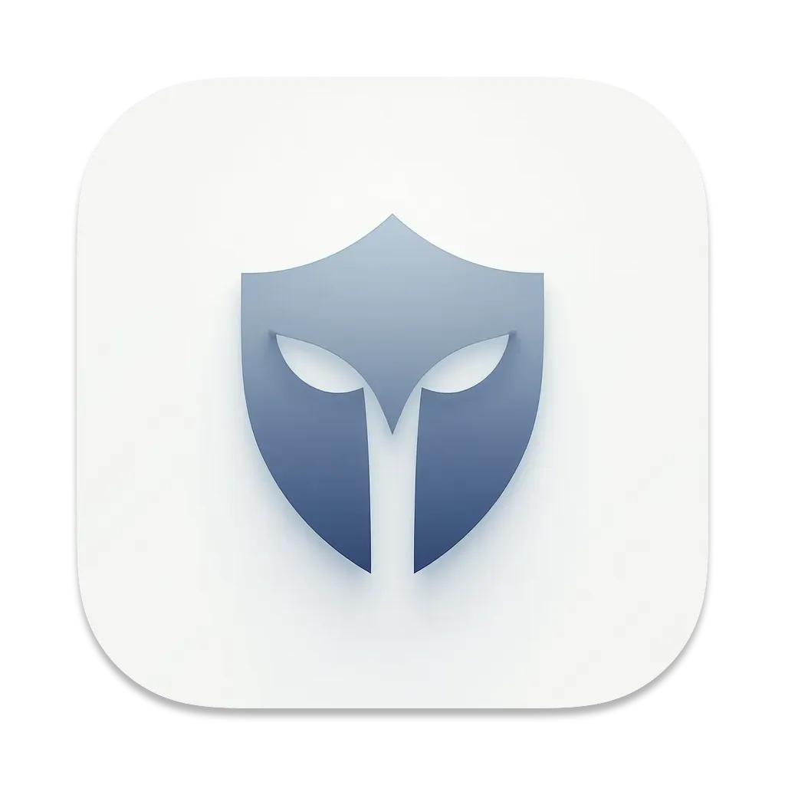

<div align="center">
  <h1>🛡️ Sentry AI</h1>
  <p><em>Your Intelligent Privacy Guardian for macOS</em></p>
  
  
  
  <p>
    
    
    
  </p>
</div>

## 🎯 Overview

Sentry AI is your intelligent workstation guardian that automatically protects your privacy by locking your Mac when you step away. Using state-of-the-art face detection AI, it provides seamless and efficient surveillance while respecting your privacy.

## ✨ Key Features

### 🤖 AI-Powered Detection

- Real-time face detection using MediaPipe
- Intelligent frame analysis optimization
- Resource-efficient processing

### 🔐 Smart Security

- Instant lock when you step away (5-second threshold)
- Seamless macOS lock integration
- Automatic monitoring resume

### 🍎 Native macOS Experience

- Elegant menu bar integration
- Dock presence for easy access
- Global keyboard shortcuts
- Launch at login support

### ⚡️ Performance Optimized

- Smart sleep mode during inactivity
- Optimized camera resolution (640x480)
- Efficient frame analysis (1:3 ratio)
- Automatic resource management

### 🎛️ System Integration

- Deep macOS integration
- Sleep mode awareness
- Intelligent interruption handling

## ⌨️ Controls & Shortcuts

| Shortcut | Action            | Description               |
|----------|-------------------|---------------------------|
| ⌘M       | Toggle Monitoring | Start/Stop face detection |
| ⌘L       | Launch at Login   | Enable/Disable auto-start |
| ⌘,       | About             | Show app information      |
| ⌘Q       | Quit              | Exit application          |

## 🚀 Getting Started

### 📋 Prerequisites

- macOS 10.13 or later
- Python 3.10
- Camera access permissions

### 🔐 macOS Installation

### Option 1: Install from Source

```bash
git clone https://github.com/Romain-Portanguen/sentry_ai.git
cd sentry_ai
make install && source .venv/bin/activate && make run
```

### Option 2: Install Pre-built Application

1. Download the latest release from [GitHub Releases](https://github.com/Romain-Portanguen/sentry_ai/releases)
2. Open the DMG file
3. Drag the application to your Applications folder
4. On first launch:
   - You should see a message about "SentryAI" being blocked
   - Click "Open Anyway"
   - In the confirmation dialog, click "Open"
   - This step is only needed once

### 📦 Build Native App

```bash
# Create standalone app
make build-mac-release

# Find in dist/Sentry AI.app
```

### 🛠️ Development Commands

```bash
make clean          # 🧹 Clean installation
make install        # 📥 Basic install
make install-dev    # 🔧 Dev environment
make run           # ▶️  Run from terminal
make build-mac     # 🔨 Dev build
make build-mac-release  # 📦 Production build
```

### 📦 Build & Distribution

```bash
# Create standalone app
make build-mac-release

# Create DMG for distribution
make create-dmg

# Find in:
# - App: dist/Sentry AI.app
# - DMG: dist/Sentry AI.dmg
```

## 🔧 Setup Guide

### 📸 Camera Access

1. Open System Settings
2. Navigate to Privacy & Security > Camera
3. Enable access for Sentry AI

### 🚀 Auto-Start (Optional)

- Use ⌘L or menu option to enable
- Starts minimized in menu bar

## 🛟 Troubleshooting

### 🔄 Installation Reset

```bash
make clean-all
make install-dev
```

### 🔍 Common Issues

- ✓ Verify camera permissions
- ✓ Check for camera conflicts
- ✓ Confirm system requirements

## 🔒 Privacy First

- 💻 **Local Processing**: All computations stay on your Mac
- 🚫 **Zero Storage**: No image data saved
- 🎯 **Smart Resource Use**:
  - Camera active only when needed
  - Efficient memory management
  - Automatic cleanup

## 📚 Dependencies

- 📸 **OpenCV** (`opencv-python-headless>=4.8.0`)
- 🤖 **MediaPipe** (`mediapipe>=0.10.0`)
- 🍎 **PyObjC-Quartz** (`pyobjc-framework-Quartz>=9.0`)
- 🔝 **Rumps** (`rumps>=0.4.0`)

## 📄 License

This project is protected under the MIT License. See [`LICENSE`](LICENSE) for details.

## 🤝 Contributing

Your contributions make Sentry AI better! Check our [contribution guidelines](CONTRIBUTING.md) to get started.

## ⚠️ macOS Security Note

Sentry AI is an open-source application not signed by Apple. macOS will display a warning on first launch. This is normal and you can safely bypass this warning because:

- The source code is fully public and verifiable
- The application doesn't require privileged system access
- All dependencies are open-source and verified

To launch the application:

1. When you first try to open the app, you'll see a warning
2. Go to System Settings > Privacy & Security
3. Scroll down to the Security section
4. You should see a message about "Sentry AI" being blocked
5. Click "Open Anyway"
6. In the confirmation dialog, click "Open"

This procedure is only necessary on first launch.

### Why this warning appears?

This warning appears because the application is not signed with an Apple Developer certificate. We keep the application unsigned to:

- Maintain complete transparency
- Keep the project fully open-source
- Avoid additional costs that would be passed to users

The application is completely safe to use, and you can verify this by:

- Reviewing our [source code on GitHub](https://github.com/Romain-Portanguen/sentry_ai)
- Building the application yourself from source
- Scanning the application with your antivirus software
